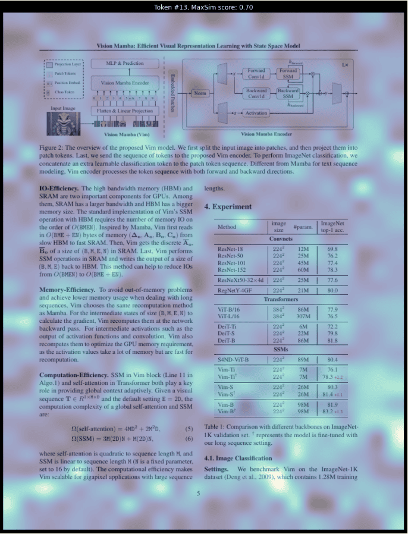

## Vision-based PDF Multi-Vector Demos (macOS/MPS)

This folder contains two demos to index PDF pages as images and run multi-vector retrieval with ColPali/ColQwen2, plus optional similarity map visualization and answer generation.

### What you’ll run
- `multi-vector-leann-paper-example.py`: local PDF → pages → embed → build HNSW index → search.
- `multi-vector-leann-similarity-map.py`: HF dataset (default) or local pages → embed → index → retrieve → similarity maps → optional Qwen-VL answer.

## Prerequisites (macOS)

### 1) Homebrew poppler (for pdf2image)
```bash
brew install poppler
which pdfinfo && pdfinfo -v
```

### 2) Python environment
Use uv (recommended) or pip. Python 3.9+.

Using uv:
```bash
uv pip install \
  colpali_engine \
  pdf2image \
  pillow \
  matplotlib qwen_vl_utils \
  einops \
  seaborn
```

Notes:
- On first run, models download from Hugging Face. Login/config if needed.
- The scripts auto-select device: CUDA > MPS > CPU. Verify MPS:
```bash
python -c "import torch; print('MPS available:', bool(getattr(torch.backends, 'mps', None) and torch.backends.mps.is_available()))"
```

## Run the demos

### A) Local PDF example
Converts a local PDF into page images, embeds them, builds an index, and searches.

```bash
cd apps/multimodal/vision-based-pdf-multi-vector
# If you don't have the sample PDF locally, download it (ignored by Git)
mkdir -p pdfs
curl -L -o pdfs/2004.12832v2.pdf https://arxiv.org/pdf/2004.12832.pdf
ls pdfs/2004.12832v2.pdf
# Ensure output dir exists
mkdir -p pages
python multi-vector-leann-paper-example.py
```
Expected:
- Page images in `pages/`.
- Console prints like `Using device=mps, dtype=...` and retrieved file paths for queries.

To use your own PDF: edit `pdf_path` near the top of the script.

### B) Similarity map + answer demo
Uses HF dataset `weaviate/arXiv-AI-papers-multi-vector` by default; can switch to local pages.

```bash
cd apps/multimodal/vision-based-pdf-multi-vector
python multi-vector-leann-similarity-map.py
```
Artifacts (when enabled):
- Retrieved pages: `./figures/retrieved_page_rank{K}.png`
- Similarity maps: `./figures/similarity_map_rank{K}.png`

Key knobs in the script (top of file):
- `QUERY`: your question
- `MODEL`: `"colqwen2"` or `"colpali"`
- `USE_HF_DATASET`: set `False` to use local pages
- `PDF`, `PAGES_DIR`: for local mode
- `INDEX_PATH`, `TOPK`, `FIRST_STAGE_K`, `REBUILD_INDEX`
- `SIMILARITY_MAP`, `SIM_TOKEN_IDX`, `SIM_OUTPUT`
- `ANSWER`, `MAX_NEW_TOKENS` (Qwen-VL)

## Troubleshooting
- pdf2image errors on macOS: ensure `brew install poppler` and `pdfinfo` works in terminal.
- Slow or OOM on MPS: reduce dataset size (e.g., set `MAX_DOCS`) or switch to CPU.
- NaNs on MPS: keep fp32 on MPS (default in similarity-map script); avoid fp16 there.
- First-run model downloads can be large; ensure network access (HF mirrors if needed).

## Notes
- Index files are under `./indexes/`. Delete or set `REBUILD_INDEX=True` to rebuild.
- For local PDFs, page images go to `./pages/`.


### Retrieval and Visualization Example

Example settings in `multi-vector-leann-similarity-map.py`:
- `QUERY = "How does DeepSeek-V2 compare against the LLaMA family of LLMs?"`
- `SIMILARITY_MAP = True` (to generate heatmaps)
- `TOPK = 1` (save the top retrieved page and its similarity map)

Run:
```bash
cd apps/multimodal/vision-based-pdf-multi-vector
python multi-vector-leann-similarity-map.py
```

Outputs (by default):
- Retrieved page: `./figures/retrieved_page_rank1.png`
- Similarity map: `./figures/similarity_map_rank1.png`

Sample visualization (example result, and the query is "QUERY = "How does Vim model performance and efficiency compared to other models?"
"):


Notes:
- Set `SIM_TOKEN_IDX` to visualize a specific token index; set `-1` to auto-select the most salient token.
- If you change `SIM_OUTPUT` to a file path (e.g., `./figures/my_map.png`), multiple ranks are saved as `my_map_rank{K}.png`.
